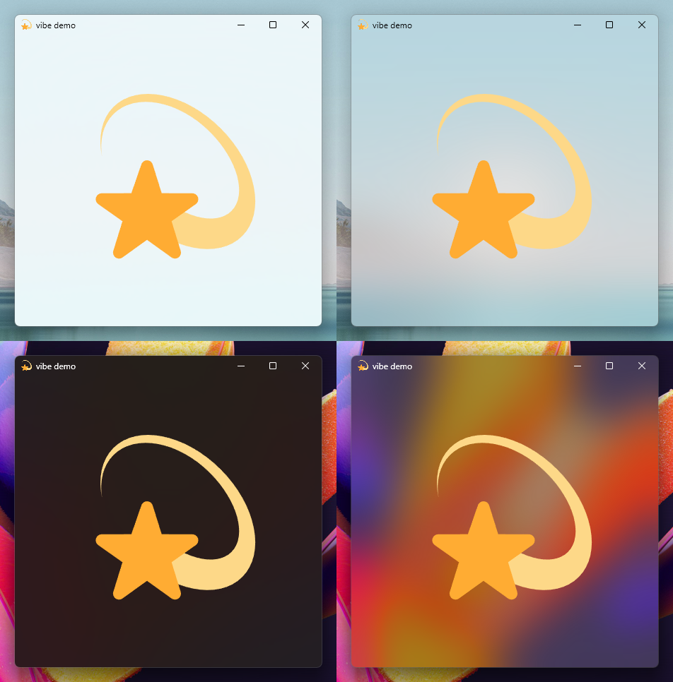

<div align=center>
    <h2>💫 <code>@pyke/vibe</code> 💫</h2>
    <h3>windows acrylic effects for electron</h3>
    <hr />
    <br /><br />
    
</div>

`vibe` is a library for acrylic/vibrancy effects for Electron on Windows. Any Electron version compatible with N-API v6 (over v11.0.0) is supported.

## Requirements
A recent version of the [Rust](https://rust-lang.org/) toolchain (>=1.58) is required. You can install it via [rustup](https://rustup.rs/).

If you don't plan on doing Rust development, you may choose to install the minimal profile in `rustup` for a lighter installation.

For end users, the Acrylic effect is supported in Windows 10 builds later than build 17763 (though performance may suffer on builds earlier than Windows 11 22000), and the Mica effect is supported in Windows 11 only. `vibe` uses an undocumented API for enabling Mica on early builds of Windows 11 (specifically <22523) that is *not heavily tested* and *may not work at all*.

## Usage
There are 3 important points you must keep in mind when using `vibe`:
- **`vibe` must do some trickery on the Electron `app` object before Electron loads in order for effects to work**, so don't forget to run `vibe.setup(app)` **before** your `app.whenReady()` callback.
- **Do not touch the frame**. Windows gets fussy about frames when you attempt to use acrylic effects. `titleBarStyle` must always be set to `default` and `frame` must always be set to `true`. While there is a way to have titlebar-less framed Mica windows, the method does not work with the way Electron creates its windows, and would unfortunately require changes in Electron's internals.
- **Both `html` and `body` need to be transparent in CSS**. It's a common mistake to only set `html` or `body` to have `background: transparent`, but they both need it. Additionally, you must set the Electron window's `backgroundColor` to `#00000000` to trick Electron into making a transparent window. **Do not set `transparent` to `true`**, as this will disable the frame and effects will break.

```js
const { app, BrowserWindow, nativeTheme } = require('electron');
const vibe = require('@pyke/vibe');

// Very important - let vibe perform its dark rituals
vibe.setup(app);

app.whenReady().then(() => {
    const mainWindow = new BrowserWindow({
        ...,

        // This part is very important!
        backgroundColor: '#00000000',

        // Recommendation: Wait to show the window to avoid an ugly flash of non-acrylic-ized content.
        show: false,
        // Recommendation: Hide the menu bar, as the colour of the bar will be solid and will look janky.
        autoHideMenuBar: true
    });

    // Apply effects! 💫
    // This should be run before the window is ready to be shown.
    vibe.applyEffect(mainWindow, 'acrylic');

    // To disable effects, run `clearEffects`.
    // The background colour of the window will be black, so you should reset the window's background colour here and/or send a message to the renderer to update the CSS.
    vibe.clearEffects(mainWindow);
    mainWindow.setBackgroundColor('#ffffff');
});
```

The `acrylic` effect for Windows 10 and below can also have a 'tint' applied to it:
```js
vibe.applyEffect(mainWindow, 'acrylic', '#AA80FF40');
```

**NOTE**: The Windows 11 22H2 'Fluent' Acrylic effect cannot be tinted and will simply follow the window/system theme (see below). You can use `vibe.platform.isWin11_22H2()` to detect if the system is Windows 11 22H2 or greater and style your app appropriately.

Additionally, you can use Electron's `nativeTheme` module to force the theme of the acrylic effects:
```js
const { nativeTheme } = require('electron');
nativeTheme.themeSource = 'dark';
```

or, for older versions of Electron:
```js
vibe.setDarkMode(mainWindow);
vibe.setLightMode(mainWindow);
```

## Thanks to:
- [**Tauri**](https://github.com/tauri-apps)'s [`window-vibrancy`](https://github.com/tauri-apps/window-vibrancy) package, which vibe borrows some code from.
- [**@alexmercerind**](https://github.com/alexmercerind) for discovering the `DwmExtendFrameIntoClientArea` hack
- [**@sylveon**](https://github.com/sylveon) for finding a workaround to `transparent: true`
- [**@GregVido**](https://github.com/GregVido) for discovering the `enable-transparent-visuals` hack
- [**Twitter**](https://twemoji.twitter.com/) for providing the `vibe` 'icon' used in the demo 💫
